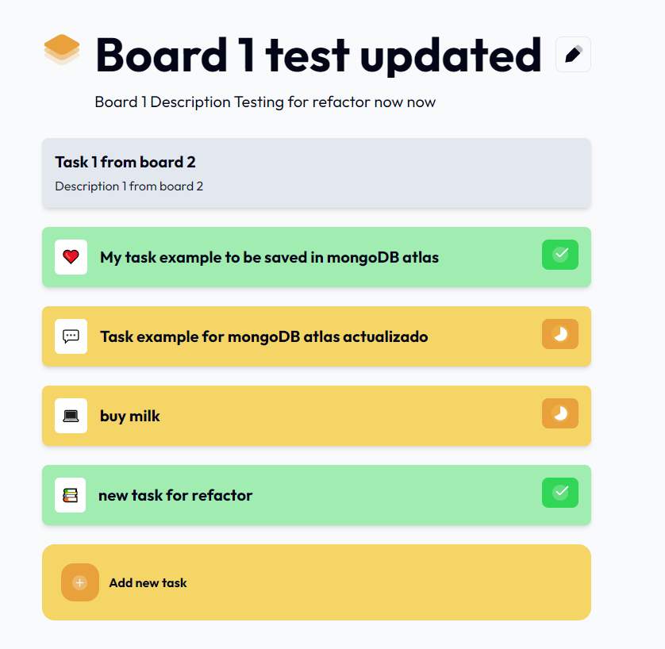

# Dev challenges - My Task Board App solution

This is a solution to the [My Task Board App](https://devchallenges.io/challenge/my-task-board-app). 

## Table of contents

- [Overview](#overview)
  - [The challenge](#the-challenge)
  - [Screenshot](#screenshot)
  - [Links](#links)
- [Start the project](#start-the-project)
    - [Prerequisites](#prerequisites)
    - [Steps](#steps)
- [My process](#my-process)
  - [Built with](#built-with)
  - [What I learned](#what-i-learned)
  - [Continued development](#continued-development)
  - [Useful resources](#useful-resources)
- [Author](#author)

## Overview

### The challenge

Users should be able to:

- See the a Board page with a Board name and description at the top
- See a list of tasks on the Board page
- Add a task (title, description, status and icon)
- Edit a task (update title, description, status and icon)
- Delete a task
- When they enter "/boards" in the URL, if they have not yet created a board, a new board will be created for them and they will be redirected to the board
- Edit the board name and description
- See the unique board id as a part of the URL (e.g. "/boards/1") and be able to share the Board with others using the URL

### Screenshot



### Links

- Solution URL: [Github Repository](https://github.com/Robertron624/fullstack-my-task-board)
- Live Site URL: [Vercel Site](https://my-task-board-seven.vercel.app/)

## Start the project

### Prerequisites

- Node.js - [Download Node.js](https://nodejs.org/en/download/)
- MongoDB Atlas account and a database - [MongoDB Atlas](https://www.mongodb.com/cloud/atlas)
- Vercel account (optional, you can use another hosting service) - [Vercel](https://vercel.com/)

### Steps

To start the project locally, follow these steps:

1. Clone the repository
```bash
git clone
```

2. Install the dependencies
```bash
npm install
```

3. Create a `.env.local` file in the root of the project and add the following environment variables:
```env
NEXT_PUBLIC_BASE_URL=http://localhost:3000 (change it in production)
NEXT_PUBLIC_MONGODB_URI=your-mongodb-database-uri
```

4. Start the development server
```bash
npm run dev
```

5. Open [http://localhost:3000](http://localhost:3000) with your browser to see the result (a list of boards will be shown, click on one to see the tasks).

6. Open [http://localhost:3000/boards](http://localhost:3000) to create a new board (you will see this new Board in Home) with a default name and description.


## My process

### Built with

- Next.js - React meta-framework (app folder)
- React.js - JavaScript library
- TypeScript - Superset of JavaScript
- TailwindCSS - A utility-first CSS framework
- MongoDB - NoSQL database
- MongoDB Atlas - Cloud database service
- Mongoose - MongoDB object modeling tool
- React-hook-form - Form validation library
- React-hot-toast - Toast notifications

### What I learned

This was a great project to work on my fullstack skills, I learned how to connect a Next.js app with a MongoDB database using Mongoose. I also learned how to use the React-hook-form library to handle forms and validation. I learned how to use toast notifications to show messages to the user.

#### Code snippets

The form to add or edit a task, it uses the react-hook-form library to handle the form and validation.

```tsx
    <form className='mt-6'
      onSubmit={handleSubmit(onSubmit)}
    >
      <label
        htmlFor='task-name'
        className='block text-sm text-medium-gray mb-1'
      >
        Task name
      </label>
      <input
        type='text'
        id='task-name'
        className={`w-full mt-1 p-2 border border-gray-300 rounded-md focus:outline-none focus:ring focus-visible:outline-2 focus-visible:outline focus-visible:border-0 focus-visible:border-none ${
          errors.taskName ? "focus-visible:outline-red" : "focus-visible:outline-blue"
        }`}
        placeholder='Enter task name'
        {...register("taskName", {
          required: true,
          maxLength: { value: TASK_NAME_MAX_LENGTH, message: "Task name is too long" },
          minLength: { value: TASK_NAME_MIN_LENGTH, message: "Task name is too short" },
        })}
      />
        {errors.taskName && (
            <p className='text-red text-sm mt-1'>
              {errors.taskName.message || "Task name is required"}
            </p>
        )}
      <label
        htmlFor='task-desc'
        className='block text-sm mt-4 text-medium-gray mb-1'
      >
        Description
      </label>
      <textarea
        id='task-desc'
        className={`w-full mt-1 p-2 border border-gray-300 rounded-md focus:outline-none focus:ring focus-visible:outline-2 focus-visible:outline focus-visible:border-0 focus-visible:border-none ${
          errors.taskDesc ? "focus-visible:outline-red" : "focus-visible:outline-blue"
        }`}
        placeholder='Enter a short description'
        rows={6}
        {...register("taskDesc", {
          required: true,
          maxLength: { value: TASK_DESCRIPTION_MAX_LENGTH, message: "Description is too long" },
          minLength: { value: TASK_DESCRIPTION_MIN_LENGTH, message: "Description is too short" },
        })}
      ></textarea>
      {errors.taskDesc && (
        <p className='text-red text-sm mt-1'>
          {errors.taskDesc.message || "Description is required"}
        </p>
      )}
      <div className='mt-6'>
        <p className='mb-2 text-medium-gray text-sm'>Icon</p>
        <div className='flex gap-3 flex-wrap'>
          {/* each of the task icon options is a radio button */}
          {taskIconOptions.map((option) => {
            return (
              <label
                key={option.label}
                className={`flex items-center w-11 h-11 justify-center rounded-lg p-3 cursor-pointer ${
                  selectedIcon === option.value
                    ? "bg-light-yellow"
                    : "bg-light-blue-gray"
                }`}
              >
                <input
                  type='radio'
                  value={option.value}
                  checked={selectedIcon === option.value}
                  className='sr-only'
                  onChange={handleIconChange}
                />
                {option.value}
                <span className='sr-only'>{option.label}</span>
              </label>
            );
          })}
        </div>
      </div>
      <div className='mt-6'>
        <p className='mb-2 text-medium-gray text-sm'>Status</p>
        <div className='flex gap-3 flex-wrap'>
          {/* each of the task status options is a radio button */}
          {statusOptions.map((option) => {
            const {
              icon: Icon,
              color,
              wrapperIcon,
            } = getStatusStyles(option.value);
            return (
              <label
                key={option.label}
                className={`flex items-center w-72 justify-start rounded-xl h-14 py-1 px-1 cursor-pointer border-[2.5px] ${
                  selectedStatus === option.value
                    ? "border-blue"
                    : "border-light-gray"
                }`}
              >
                <input
                  type='radio'
                  name='taskStatus'
                  value={option.value}
                  checked={selectedIcon === option.value}
                  onChange={handleStatusChange}
                  className='sr-only'
                />
                <div className='flex gap-2 items-center font-medium'>
                  <div className={`rounded-lg ${wrapperIcon} px-2 py-1`}>
                    {Icon && <Icon />}
                  </div>
                  {option.label}
                </div>
                <span className='sr-only'>{option.label}</span>
              </label>
            );
          })}
        </div>
      </div>
      <div className='flex mt-28'>
        {isEditMode ? (
          <div className='flex gap-4 justify-end items-center w-full'>
            <button
              type='submit'
              name="delete"
              className=' bg-medium-gray text-very-light-gray py-2 px-8 mt-4 rounded-2xl font-semibold flex gap-2 items-center hover:bg-red duration-300 ease-in-out'
            >
              Delete
              <Image
                src='/images/Trash.svg'
                alt='Delete'
                width={20}
                height={20}
              />
            </button>
            <button
              type='submit'
              name="save"
              className=' py-2 px-8 mt-4 rounded-2xl font-bold ml-2 flex items-center gap-2 bg-blue text-very-light-gray hover:bg-dark-blue duration-300 ease-in-out'
            >
              Save
              <Image
                src='/images/Done_round.svg'
                alt='Save'
                width={20}
                height={20}
              />
            </button>
          </div>
        ) : (
          <button
            type='submit'
            className='w-full bg-light-yellow py-2 px-4 mt-4 rounded font-bold hover:bg-yellow-500 duration-300 ease-in-out'
          >
            Add task
          </button>
        )}
      </div>
    </form>
```

The function to handle the form submission, when it's in edit mode, it will show a delete and update button, otherwise it will show an add button,
When in edit mode, both the edit and delete buttons can submit the form, we need to check which button was clicked to know if we need to update or delete the task.

```ts
  const onSubmit: SubmitHandler<TaskFormValues> = async(data, event) => {

    event?.preventDefault();

    const { taskName, taskDesc, taskIcon, taskStatus } = data;

    const dataToSubmit = {
      name: taskName,
      description: taskDesc,
      icon: taskIcon,
      status: taskStatus || "to-do",
    };

    let isToastSuccess = false;
    let toastMessage = "";

    const target = event?.nativeEvent as SubmitEvent;
    const submitter = target.submitter as HTMLButtonElement;

    if(isEditMode) {
      // if it's in edit mode, the task won't be falsy
      const taskId = task?._id as string

      const editDataToSubmit = {
        ...dataToSubmit,
        _id: taskId,
      };
      
      if(submitter.name === "delete") {
        try {
          
          await deleteTask(taskId, boardId);
          toastMessage = "Task deleted successfully";
          isToastSuccess = true;
        } catch (error) {
          console.error("Error deleting task: ", error);
          toastMessage = "Failed to delete task";
        }
      }
      else {
        try{
          await updateTask(editDataToSubmit, boardId);
          toastMessage = "Task updated successfully";
          isToastSuccess = true;
        } catch (error) {
          console.error("Error updating task: ", error);
          toastMessage = "Failed to update task";
        }
      }
    }
    else {
      try {
        await addNewTask(dataToSubmit, boardId);
        toastMessage = "Task added successfully";
        isToastSuccess = true;
      } catch (error) {
        console.error("Error adding task: ", error);
        toastMessage = "Failed to add task";
      }
    }

    if(!isToastSuccess) {
      toast.error(toastMessage, {
        duration: 3000,
        position: "top-right",
        icon: "❌",
      });
      return;
    }
    
    toast.success(toastMessage, {
      duration: 3000,
      position: "top-right",
      icon: "🎉",
    });

    // reset form values and close modal
    resetForm();

    // close modal
    onCloseModal();

    // refresh the page to show the new task
    router.refresh();
  };

```

The function/endpoint ("api/boards/[boardId]/tasks/[taskId]") to update a task:
```ts
export async function PUT(
  req: NextRequest,
  { params }: { params: { boardId: string, taskId: string } }
) {
  try {
    const { boardId, taskId } = params;
    await connectToMongoDB();

    const updatedTask = await req.json();

    if (!isTask(updatedTask)) {
      throw new Error("Invalid task data");
    }

    if (updatedTask.name.length > TASK_NAME_MAX_LENGTH) {
      return NextResponse.json({ error: `Task name must be less than ${TASK_NAME_MAX_LENGTH} characters`, success: false }, { status: 400 });
    }

    if (updatedTask.description && updatedTask.description.length > TASK_DESCRIPTION_MAX_LENGTH) {
      return NextResponse.json({ error: `Task description must be less than ${TASK_DESCRIPTION_MAX_LENGTH} characters`, success: false }, { status: 400 });
    }

    const board = await Board.findById(boardId).exec();

    if (!board) {
      return NextResponse.json({ error: "Board not found", success: false }, { status: 404 });
    }

    const task = board.tasks.id(taskId);

    if (!task) {
      return NextResponse.json({ error: "Task not found", success: false }, { status: 404 });
    }

    task.set(updatedTask);

    await board.save();

    return NextResponse.json({
      success: true,
      message: "Task updated successfully",
      updatedTask,
    });
  } catch (error: any) {
    console.error("Error updating task: ", error);
    const customErrorMessage = "An error ocurred while updating the task.";
    return NextResponse.json({ error: customErrorMessage }, { status: 500 });
  }
}
```

### Continued development

Since I've been working with mongoDB and Non SQL databases, I would like to continue working in the future with SQL databases to learn more about them. I would also like to learn more about backend development and instead of using a REST API, I would like to learn how to use GraphQL. I've been working with Next.js for a while now and I would like to learn more about it and how to use it to its full potential.

### Useful resources

- [Integrate with Vercel](https://www.mongodb.com/docs/atlas/reference/partner-integrations/vercel/) - This article helped me to integrate MongoDB Atlas with Vercel, needed to configure the database connection to allow the app to work in production.
- [Mongoose documentation](https://mongoosejs.com/docs/) - This documentation helped me to understand how to use Mongoose to interact with MongoDB.

## Author

- Website - [Robert Ramirez](https://www.robert-ramirez.co)
- Frontend Mentor - [@Robertron624](https://frontendmentor.io/profile/Robertron624)
- Github - [@Robertron624](https://github.com/Robertron624)
